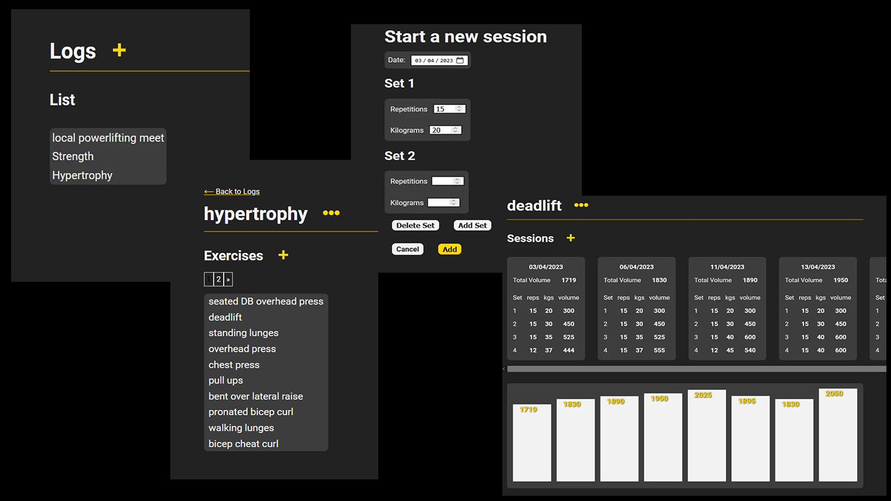

# WORKOUT TRACKER

Visit the website [here](https://www.workouttrackr.com/)

### A Workout Tracker

This app is created with nodejs, expressjs and mongoDB. It is meant to be a workout tracker. Currently you can only track weightlifting with sets and repetitions. I am planning to add more features.

It includes the following:

- GET/POST/PUT/DELETE routes
- Passport for authentication
- Reset password with SendGrid
- Authorization
- Templating with EJS
- Mongoose Schemas with deep nesting
- Data visualization with d3js
- Some web security stuff

